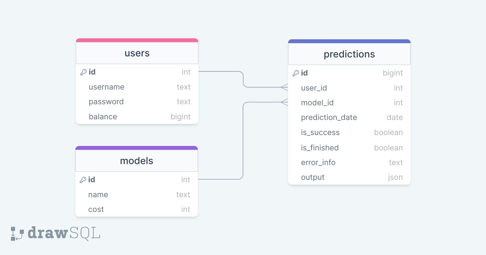

# Задача №5: Прогнозирование выживания пациентов с циррозом печени

## Описание проекта

Данный проект посвящен разработке сервиса по предсказанию выживаемости пациентов с циррозом печени.

Проект представляет собой ML-сервис, построенный с использованием FastAPI, современного и быстрого веб-фреймворка для создания API с Python 3.7+. Сервис включает в себя различные компоненты, в том числе аутентификацию пользователей, управление моделями и обработку предсказаний.

## Бизнес-логика
 - Пользователь может как зарегестрироваться, так и войти в свой аккаунт. 
 - Изначально каждый пользователь имеет 1000 кредитов.
 - Пользователи могут загружать csv-файлы и получать по ним предсказания.
 - Пользователи могут выбрать следующие модели:
   - SVC (100 кредитов);
   - Random Forest (250 кредитов);
   - Catboost (500 кредитов).

## Схема БД



## Инструкция по запуску

### Шаг 1
Склонируйте репозиторий командой:
```
git clone https://github.com/kazars24/Practice-ML-DEV.git
```
И перейдите в папку Practice-ML-DEV:
```
cd Practice-ML-DEV
```

### Шаг 2
Установите все необходимые зависимости:
```
pip install -r requirements.txt
```

### Шаг 3
Выполните команду:
```
uvicorn app:app --reload --port 8001
```

### Шаг 4
Пользуйтесь сервисом)

## WebUI
