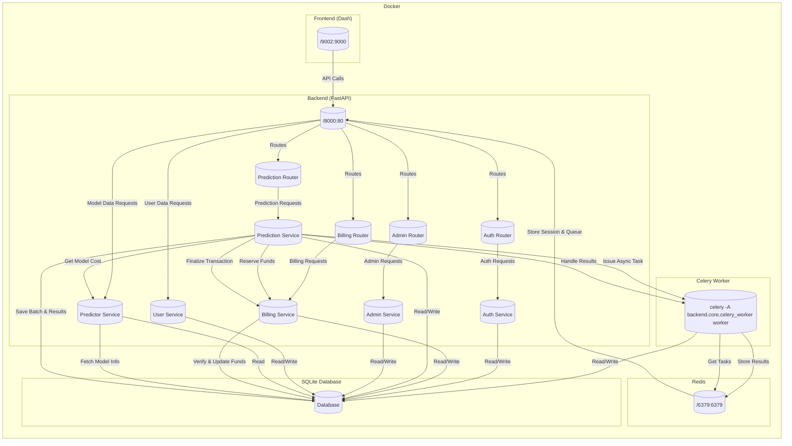

```mermaid
graph LR
    subgraph Docker
    subgraph Frontend ["Frontend (Dash)"]
    FE[("/9002:9000")]
    end
    
    subgraph Backend ["Backend (FastAPI)"]
    BE[("/8000:80")]
    PredictionRouter[("Prediction Router")]
    BillingRouter[("Billing Router")]
    AuthRouter[("Auth Router")]
    AdminRouter[("Admin Router")]
    Prediction[("Prediction Service")]
    Billing[("Billing Service")]
    Auth[("Auth Service")]
    Admin[("Admin Service")]
    UserService[("User Service")]
    PredictorService[("Predictor Service")]
    end
    
    subgraph CeleryWorker ["Celery Worker"]
    CW[("celery -A backend.core.celery_worker worker")]
    end
    
    subgraph Redis ["Redis"]
    RD[("/6379:6379")]
    end
    
    subgraph SQLite ["SQLite Database"]
    DB[("Database")]
    end
    
    FE -->|API Calls| BE
    BE -->|Routes| PredictionRouter
    BE -->|Routes| BillingRouter
    BE -->|Routes| AuthRouter
    BE -->|Routes| AdminRouter
    PredictionRouter -->|Prediction Requests| Prediction
    BillingRouter -->|Billing Requests| Billing
    AuthRouter -->|Auth Requests| Auth
    AdminRouter -->|Admin Requests| Admin
    BE -->|User Data Requests| UserService
    BE -->|Model Data Requests| PredictorService
    Prediction -->|Issue Async Task| CW
    CW -->|Store Results| RD
    CW -->|Get Tasks| RD
    CW -->|Read/Write| DB
    RD -->|Store Session & Queue| BE
    Auth -->|Read/Write| DB
    Billing -->|Read/Write| DB
    Prediction -->|Read/Write| DB
    Admin -->|Read/Write| DB
    UserService -->|Read/Write| DB
    PredictorService -->|Read| DB

    Prediction -->|Reserve Funds| Billing
    Billing -->|Verify & Update Funds| DB
    Prediction -->|Get Model Cost| PredictorService
    PredictorService -->|Fetch Model Info| DB
    Prediction -->|Handle Results| CW
    Prediction -->|Finalize Transaction| Billing
    Prediction -->|Save Batch & Results| DB
    end
```