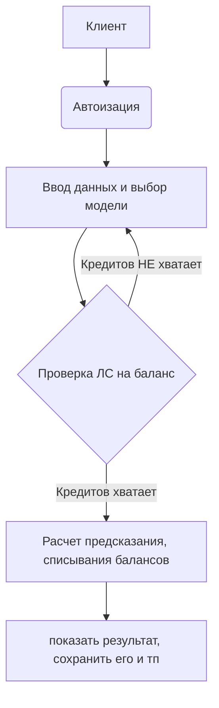
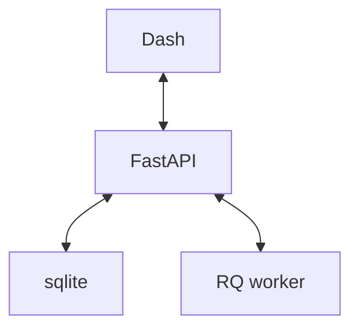

```mermaid
graph TD
  Client[ Клиент ] --> Auth(Автоизация)
  Auth --> Inputer[ Ввод данных и выбор модели ]
  Inputer --> Billing{ Проверка ЛС на баланс}
  Billing -->| Кредитов хватает | Predict[ Расчет предсказания, списывания балансов ]
  Billing -->| Кредитов НЕ хватает | Inputer
  Predict --> Dash[ показать результат, сохранить его и тп]
```

```mermaid
graph TD
Webui[ Dash ] <--> Backend[FastAPI]
Backend <--> DB[sqlite]
Backend <--> RQ[RQ worker]


```
