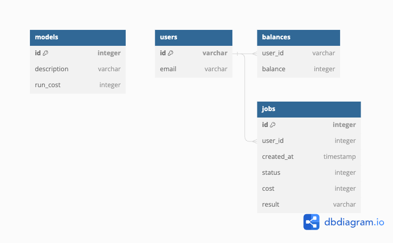

# Дизайн и архитектура приложения для распознования вредоносного ПО

## Архитектура

Основные принципы для быстрой разработки MVP:

1. Персистентность — SQLite с перспективой PostgreSQL для горизонального масштабирования
2. Пользователи взаимодействуют с приложением только через веб-клиент на базе dash
3. FastAPI также работает как gateway-сервер, внутри которого запущен dash
4. Для управления пользователями и авторизации используем [fastapi-users](https://fastapi-users.github.io/fastapi-users/12.1/) c JWT в cookie
5. Вычисления запускаются асинхронно на одной машине с основным приложением через FastAPI background task

Принципиальная схема приложения:

## Структура API

В следющем задании FastAPI автоматически сгенерирует OpenAPI-схему, так что пока просто опишу эндпойнты на пальцах. Все эндпойнты находятся под префиксом `/api`, чтобы было на какие роуты добавить UI.

`/api/auth` — эндпойнты для работы с авторизацией (регистрация, вход) проксируется в fastapi-users [описание](https://fastapi-users.github.io/fastapi-users/12.1/usage/routes/)

Все остальные ручки закрыты авторизайией и возвращают только данные, которые видны пользователю:

- `GET /api/models` — список доступных моделей со стоимостью запуска
- `/api/jobs` — работа с задачами
  - `GET /api/jobs` — список моих задач со статусом выполнения, но без результата предсказаний
  - `GET /api/jobs/:id` — результат предсказания по задаче
  - `POST /api/jobs` — создать новую задачу
- `/api/balance` — мой баланс
  - `GET /api/balance` — мой текущий баланс
  - `POST /api/balance/refill` — "пополнить" баланс

## Структура БД

Помимо таблиц от fastapi-users создаем 3 таблицы: 

- `models` — список доступных моделей со стоимостью запуска для добавления и изменения моделей без привлечения разработки
- `jobs` — вычисления пользователей: статус (выполняется / готово / ошибка), стоимость (на момент запуска), результат выполнения (в виде JSON-строки для MVP, в перспективе — ключ S3 для скачивания файла)
- `balances` — "голый" баланс пользователя без учета незавершенных джоб. Для получения бухгалтерского баланса из этого значения вычитаем стоимость всех незавершенных джоб.

